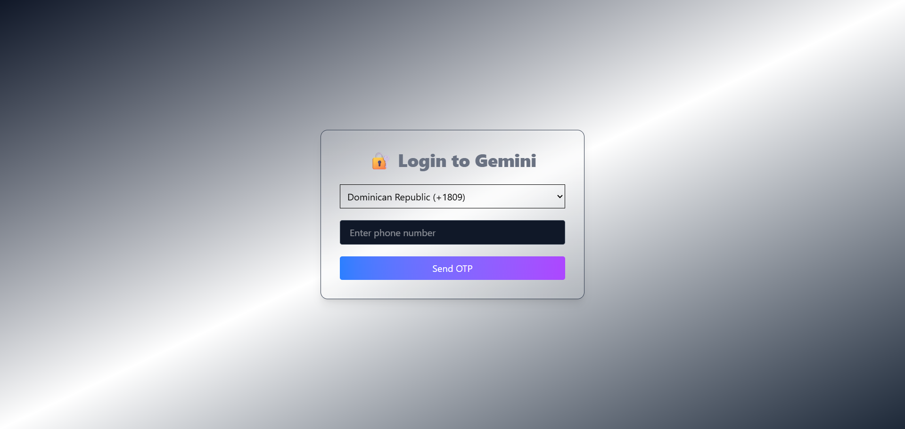
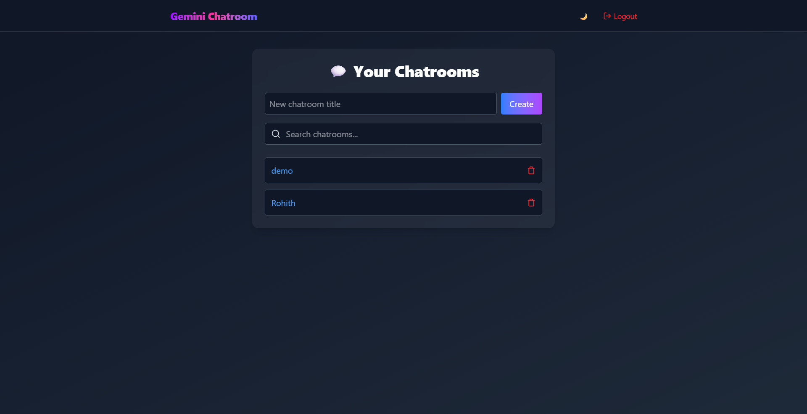
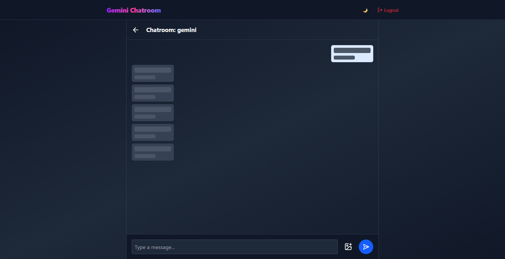
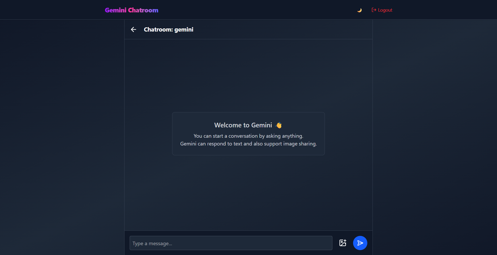
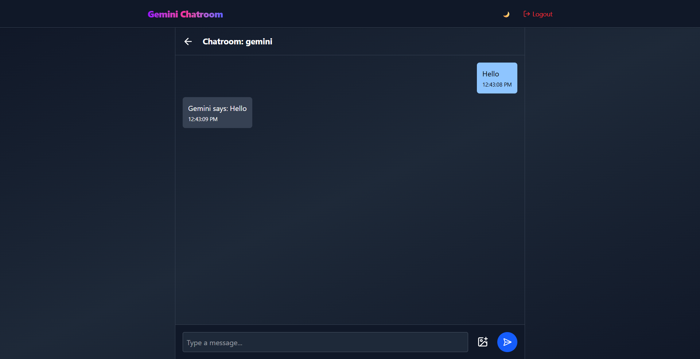

# 🌟 Gemini Chatroom – AI Chat UI with OTP Login

A fully responsive, beautifully styled AI chat interface built with **React**, **TypeScript**, and **TailwindCSS**. Includes support for OTP-based login, country code selector, simulated AI replies, image upload, and a dark mode experience.

Deployed on 👉 **[Netlify](https://gemini-chatroom.netlify.app )**







---

## ✨ Features

### ✅ Core Functionalities

- **OTP-based Login/Signup flow**

  - Phone number login with country code selector
  - Validates via Zod schema
  - Simulated OTP verification using `1234`

- **Chatroom Creation & Navigation**

  - Create multiple chatrooms with custom titles
  - Navigate between chatrooms using React Router
  - Each chatroom has its own stored history

- **Simulated AI Chat UI**

  - User and fake Gemini AI messages
  - Timestamps shown for each message
  - Typing indicator: _"Gemini is typing..."_
  - Gemini replies after a delay using `setTimeout`
  - Gemini responses throttled to simulate delayed AI thinking
  - Auto-scroll to latest message
  - Image upload support (base64 preview)
  - Click-to-copy message content with hover hint

- **Debounced Search Bar**

  - Search chatrooms by title with a 300ms debounce

- **Dark Mode Support**

  - Toggle light/dark mode with a beautiful transition
  - Fully styled for both themes using Tailwind's `dark:` variant

- **Responsive UI**

  - Works great on mobile and large screens
  - Centered layouts, intuitive spacing, and gradients

- **Persistent Storage with LocalStorage**

  - Auth state
  - Chatroom list
  - Chat history per room

- **Toasts & Feedback**

  - Toast notifications using `sonner`
  - Shown for actions like:
    - OTP sent
    - Message sent
    - Chatroom deleted

- **Loading UX**
  - Full-screen loader while fetching data
  - Loading skeletons for chat messages

---

## 🧱 Tech Stack

| Tech            | Purpose               |
| --------------- | --------------------- |
| React + Vite    | UI framework          |
| TypeScript      | Type-safe development |
| TailwindCSS v4  | Utility-first styling |
| react-hook-form | Form handling         |
| Zod             | Schema validation     |
| Lucide-react    | Beautiful SVG icons   |
| Sonner          | Toast notifications   |
| Netlify         | Deployment            |

---

## 🔐 OTP Login Flow

- On login screen:
  - User selects country using `restcountries.com` API data
  - Inputs phone number
  - Simulated OTP (hardcoded: **1234**) is "sent"
  - User inputs OTP
  - On success, `loggedIn` flag is saved in localStorage
  - Navigates to `/dashboard`

---

## 💬 Chatroom Page

- Messages are stored in `localStorage` with a `chat-${id}` key
- On refresh, messages persist
- You can:
  - Send text messages
  - Upload images (base64 preview)
  - See typing indicator
  - Watch auto-scroll in action
  - Copy messages on click

---

## 📂 Project Structure

      src/
    ├── components/
        ├──pages/
    │      ├── Chatroom/
    │      ├── Login/
    │      └── Dashboard/
    ├── models/
    │ ├── schema.ts
    │ └── typeDefinitions.ts
    ├── shared/
    │ ├── Loader.tsx
    │ ├── FileUpload.tsx
    │ ├── CountrySelector.tsx
    │ ├── Header.tsx
    │ ├── MessageSkeleton.tsx
    │ ├── Wrapper.tsx
    │ ├── ProtectedRoute.tsx
    │ ├── PublicOnlyRoute.tsx
    │ └── DarkModeToggle.tsx
    ├── hooks/
    │ └── apiCall.ts
    ├── services/
    │ └── apiService.ts
    ├── App.tsx
    ├── main.tsx

---

## 🚀 Getting Started

### 1. Clone the Repo

```bash
git clone https://github.com/Nampallyrohith/chatroom
cd gemini-chatroom
```

### 2. Install Dependencies

```
  npm install
  # or
  yarn install

```

### 3. Run Locally

```
  npm run dev
  # or
  yarn dev
```

### 4. Build for Production

```
  npm run build
```
